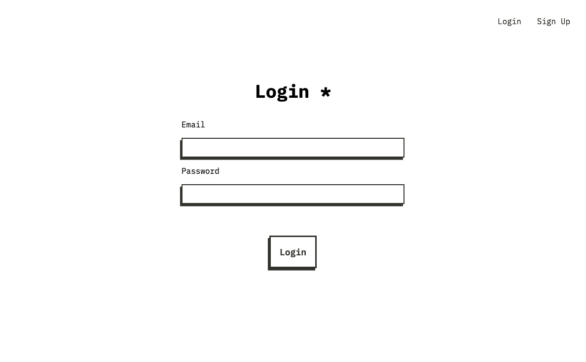
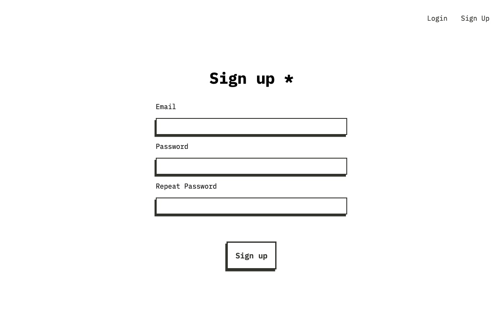
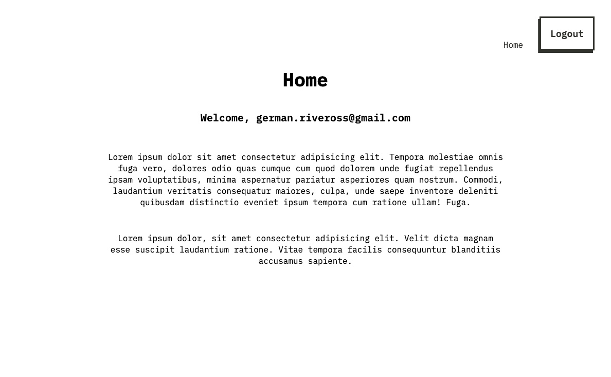

# Autenticación con Vue y Firebase

Este repositorio contiene la solución al desafío propuesto por DesafíoLatam, enfocado en validar conocimientos sobre Firebase y Vue Router mediante la creación de una aplicación web con autenticación. El proyecto incluye funcionalidades básicas de registro, inicio de sesión y acceso restringido a una vista privada, utilizando Firebase Authentication, Firebase Hosting y Vue Router.

## Descripción del Proyecto

El desafío consiste en desarrollar una aplicación web con tres vistas principales: 

1. **Sign Up**: Vista pública destinada al registro de nuevos usuarios. Solo accesible para usuarios no autenticados.
2. **Login**: Vista pública para el inicio de sesión. Solo accesible para usuarios no autenticados.
3. **Home**: Vista privada accesible únicamente para usuarios autenticados. Los usuarios no registrados serán redirigidos automáticamente a la vista Sign Up.

El acceso a la vista privada está controlado mediante guardianes de Vue Router para garantizar la seguridad de la navegación.

## Requerimientos Técnicos

Para completar el desafío, se implementaron las siguientes funcionalidades:

1. **Sistema de autenticación**: Integración de Firebase Authentication para el manejo de usuarios.
2. **Restricción de acceso**: Uso de guardianes de Vue Router para limitar el acceso a la vista Home.
3. **Componente de registro**: Creación de un formulario que permite registrar nuevos usuarios.
4. **Componente de inicio de sesión**: Desarrollo de un formulario para permitir a los usuarios autenticarse.
5. **Despliegue en producción**: Generación del build de producción y despliegue mediante Firebase Hosting.

## Imágenes del desafío

### Ver el resultado final 👉 [aquí](https://project-6910276961115775432.web.app/)